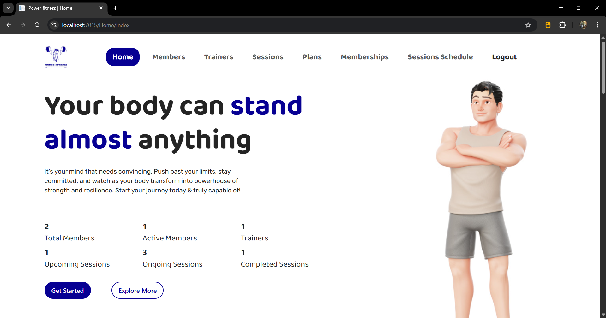
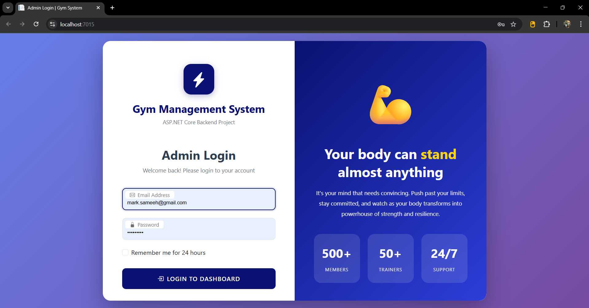
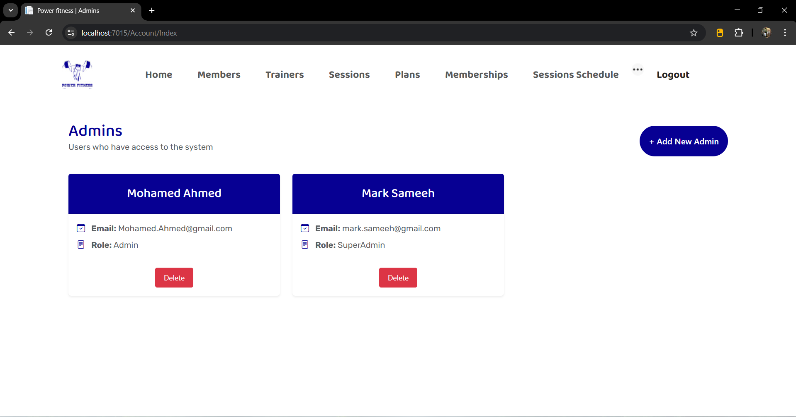
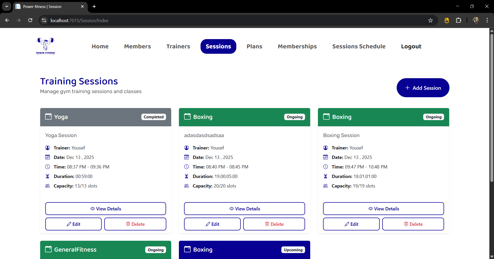

# Gym Management System 🏋️‍♂️

A full-featured **Gym Management System** built with **ASP.NET MVC**, **Entity Framework Core**, and **SQL Server**, following a **clean layered architecture** and enforcing real-world **business logic validation**.

This project demonstrates strong **backend development fundamentals**, including separation of concerns, data access patterns, and business rules implementation, with a modern and clean admin dashboard UI.

---

## 🚀 Features

- Manage **Members**, **Trainers**, **Sessions**, and **Subscriptions**
- Full **CRUD operations** with server-side validation
- **Session scheduling** with real-world business logic constraints
- Dashboard with real-time statistics
- **Authentication & Authorization** (Admin-only access)
- Manage **Admins** with roles (**Admin / SuperAdmin**)
- Clean separation using **Layered Architecture (PL / BLL / DAL)**

---

## 🛠️ Technologies Used

- **ASP.NET MVC**
- **Entity Framework Core**
- **SQL Server**
- **LINQ**
- **AutoMapper**
- **Bootstrap** (UI styling for MVC views)

---

## 🧱 Architecture

The project follows a clean **Layered Architecture**:

### 📌 Presentation Layer (PL)
- MVC Controllers & Views  
- Handles HTTP requests and UI rendering only

### 📌 Business Logic Layer (BLL)
- Application services  
- Business rules & validations

### 📌 Data Access Layer (DAL)
- Repositories  
- EF Core DbContext & database access

---

## 📸 Screenshots

### 🏠 Admin Dashboard


---

### 🔐 Admin Login


---

### 👤 Admins Management


---

### 🏋️ Training Sessions


---

## 🔑 Demo Admin Credentials

Use the following demo accounts to explore the system:

### 👑 Super Admin
- **Email:** mark.sameeh@gmail.com  
- **Password:** P@ssw0rd!

### 🛡️ Admin
- **Email:** Mohamed.Ahmed@gmail.com  
- **Password:** P@ssw0rd!

> ⚠️ These credentials are for demo purposes only.

---

## ⚙️ How to Run

1. Clone the repository:
   ```bash
   git clone https://github.com/mark26504/gym-management-system.git
